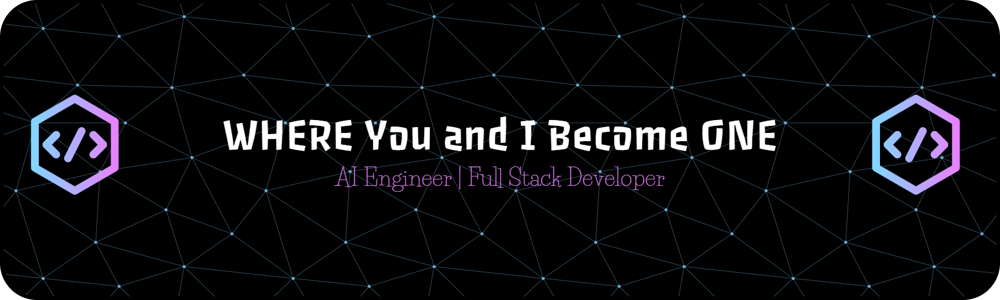

  

# 
I help startups, creators, and tech-driven businesses build intelligent, scalable, and automated systems that turn ideas into real products.

From AI agents to full SaaS platforms, I design end-to-end solutions that are fast, smart, secure, and production-ready.

🔹 **AI Products & LLM Systems** — AI agents, copilots & assistants, RAG systems with embeddings, Intelligent chatbots, Workflow automation with LLMs, Custom AI tools for business logic 
🔹 **SaaS Platforms & Web Applications** — Full-stack SaaS products, Dashboards & admin panels, Auth, billing, roles & subscriptions, API-first backend systems 
🔹 **Automation, Bots & Integrations** — Telegram, Discord & trading bots, Background workers & queues, Event-driven microservices, Business process automation 
🔹 **Data Systems & Scraping Infrastructure** — Web scraping at scale, ETL & data pipelines, Real-time ingestion systems, Data processing & normalization, Analytics-ready datasets 
🔹 **Infrastructure, Scaling & Deployment** — Cloud architecture & CI/CD, Dockerized environments, Performance optimization, Security best practices, Monitoring & scalability 
 

#
<table align="center" style="table-layout: fixed;">
  <tr>
    <td align="center" width="94">
      
       Python
    </td>
    <td align="center" width="94">
      
       OpenAI
    </td>
    <td align="center" width="94">
      
       Hugging Face
    </td>
    <td align="center" width="94">
      
       PyTorch
    </td>
    <td align="center" width="94">
      
       Tensor Flow
    </td>
    <td align="center" width="94">
      
       Scikit-learn
    </td>
    <td align="center" width="94">
      
       LangChain
    </td>
    <td align="center" width="94">
      
       Pinecone
    </td>
    <td align="center" width="94">
      
       Jupyter
    </td>
    <td align="center" width="94">
      
       Pandas
    </td>
  </tr>
  <tr>
    <td align="center" width="94">
      
       NumPy
    </td>
    <td align="center" width="94">
      
       Streamlit
    </td>
    <td align="center" width="94">
      
       FastAPI
    </td>
    <td align="center" width="94">
      
       Node.js
    </td>
    <td align="center" width="94">
      
       Express
    </td>
    <td align="center" width="94">
      
       GraphQL
    </td>
    <td align="center" width="94">
      
       PostgreSQL
    </td>
    <td align="center" width="94">
      
       MongoDB
    </td>
    <td align="center" width="94">
      
       Redis
    </td>
    <td align="center" width="94">
      
       JavaScript
    </td>
  </tr>
  <tr>
    <td align="center" width="94">
      
       TypeScript
    </td>
    <td align="center" width="94">
      
       React
    </td>
    <td align="center" width="94">
      
       Next.js
    </td>
    <td align="center" width="94">
      
       Vue.js
    </td>
    <td align="center" width="94">
      
       Tailwind CSS
    </td>
    <td align="center" width="94">
      
       Jest
    </td>
    <td align="center" width="94">
      
       RabbitMQ
    </td>
    <td align="center" width="94">
      
       Kafka
    </td>
    <td align="center" width="94">
      
       Docker
    </td>
    <td align="center" width="94">
      
       AWS
    </td>
  </tr>
</table>

# 

     

